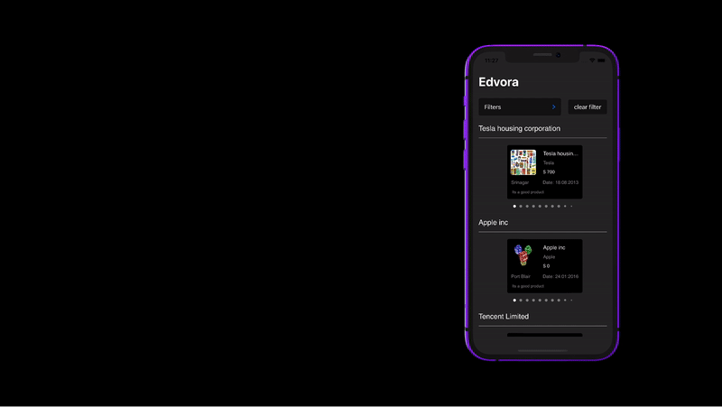

# Edvora Interview Project

This project is a Take Home Project(Interview Project) assigned by Edvora for the role of iOS Intern. 

## Tech Stack:
- SwiftUI 
- Combine for Networking
- AsyncImage for Image Loading
- MVVM

## Screenshots:

  
  
  
  
  

## Video Demo Link:
https://youtu.be/RTObNCQl1M0

## Note: 
- Did my best to replicate the app exactly from the Figma design file provided. 
- Faced some problems in getting page indicators, was not able to get page indicators with ScrollView, hence implemented the same using TabView with .page style.
- Have added a cool animation using GeometryReader when products are scrolled horizontally.  

## Contact Info:
- Email: aryanshrivastava.3@gmail.com
- LinkedIn: https://linkedin.com/in/aryan-shrivastava
- Twitter: https://twitter.com/AS11_twt

